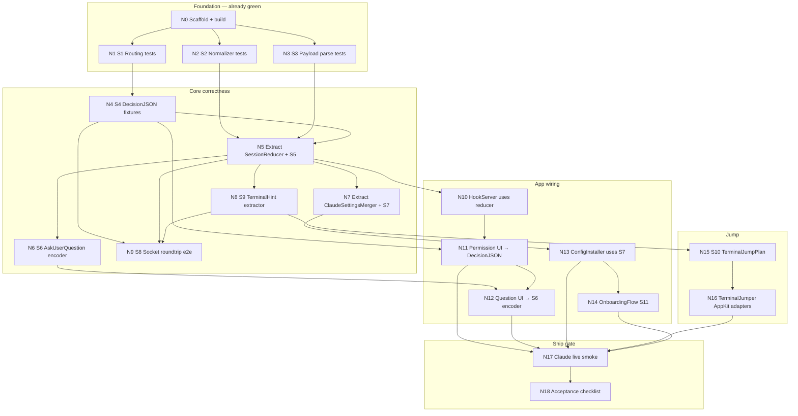

# Bezel — TDD + DAG Implementation Plan

**Status:** active  
**Method:** London-school TDD (mock-first at seams) · red → green · vertical slices  
**Domain language:** `CONTEXT.md`

---

## 1. Confirmed test seams

Tests attach **only** at these public boundaries. No private-method tests. No UI snapshot farming.

| ID | Seam | Module | Observes |
|----|------|--------|----------|
| S1 | `PermissionRouting.routeKind` | BezelCore | blocking vs event classification |
| S2 | `EventNormalizer.pascalCase` | BezelCore | vendor → Claude event names |
| S3 | `HookPayload.parse` | BezelCore | stdin JSON → typed envelope |
| S4 | `DecisionJSON.*` | BezelCore | allow/deny/question stdout bytes |
| S5 | `SessionReducer.apply` *(extract)* | BezelCore | envelope → session phase transitions |
| S6 | `AskUserQuestionEncoder.encode` *(new)* | BezelCore | answers → Claude `updatedInput` JSON |
| S7 | `ClaudeSettingsMerger.merge` *(extract)* | BezelCore | existing settings + Bezel hooks, idempotent |
| S8 | `UnixSocketRoundtrip` | BezelCoreTests / e2e | bridge client ↔ in-process server |
| S9 | `TerminalHintExtractor` *(extract)* | BezelCore | env dict → `TerminalHint` |
| S10 | `TerminalJumpPlan` *(new)* | BezelCore | hint → jump strategy enum (pure) |
| S11 | `OnboardingFlow.reduce` *(extract)* | BezelCore | step + intent → next step / effects |
| S12 | AppKit/SwiftUI | Bezel | **manual QA only** for Phase 1 (not unit-tested) |

**Out of unit scope (Phase 1):** DynamicNotchKit layout, Accessibility TCC prompts, real Claude Code process.

---

## 2. TDD rules for this repo

1. **Red before green** — failing Swift Testing test first, then minimal code.
2. **One slice = one seam behavior** — no horizontal “write all tests then implement.”
3. **Expected values from the protocol** — Claude hook docs / fixture JSON literals, not recomputed tautologies.
4. **Dual-routing invariant** — every new agent source adds a `PermissionRouting` test **and** a bridge blocking fixture in the same PR.
5. **Extract before decorate** — move logic from `SessionStore` / `ConfigInstaller` into BezelCore pure functions so TDD can reach it.
6. **E2E after unit green** — socket roundtrip only after S1–S4 + S5 are green for that event.

---

## 3. DAG — task graph

Nodes are **vertical slices**. Edge `A → B` means B depends on A (A must be green first).



### Critical path (shortest path to Claude live)

```
N4 → N5 → N6 → N12 → N17 → N18
         ↘ N7 → N13 ↗
         ↘ N9 ─────↗
```

Jump (N15–N16) can ship **after** first Claude permission works; do not block N17 on Jump if timeboxed — mark Jump as soft-dep with activate-only fallback.

---

## 4. Node catalog (TDD slices)

### N4 — DecisionJSON fixtures · Seam S4
**RED:** assert exact UTF-8 JSON for allow / deny / always-allow / empty ack.  
**GREEN:** tighten `DecisionJSON` to match Claude docs (no string interpolation bugs).  
**Done when:** golden fixtures in `Tests/Fixtures/decisions/*.json` match byte-for-byte (ignoring key order via canonical compare).

### N5 — SessionReducer · Seam S5
**RED:** table-driven phase transitions:

| Given phase | Event | Expect phase |
|-------------|-------|--------------|
| (new) | SessionStart | working |
| working | PermissionRequest | waitingPermission |
| working | PreToolUse AskUserQuestion | waitingQuestion |
| waitingPermission | (decision resolved) | working |
| working | Stop | done |
| working | SessionEnd | done |
| working | PreToolUse ExitPlanMode | planReview |

**GREEN:** extract `SessionReducer.apply(session:event:) -> Session` from `SessionStore`; store becomes a thin holder.  
**Done when:** all table rows green; `SessionStore` calls reducer only.

### N6 — AskUserQuestion encoder · Seam S6
**RED:** given `tool_input.questions` + user picks → stdout JSON with `permissionDecision: allow` + `updatedInput.{questions,answers}`.  
**GREEN:** `AskUserQuestionEncoder`.  
**Done when:** fixture from Claude docs §AskUserQuestion passes; missing `questions` echo fails the test (regression for Claude crash).

### N7 — ClaudeSettingsMerger · Seam S7
**RED:**
- empty file → writes Bezel hooks for required events
- existing foreign hooks preserved
- second merge is idempotent (no duplicate bezel commands)
- AskUserQuestion matcher group present with timeout 600

**GREEN:** pure merge in BezelCore; `ConfigInstaller` writes disk only.  
**Done when:** merge tests use temp `Data` only (no `$HOME` mutation).

### N8 — TerminalHint extractor · Seam S9
**RED:** env dict with `ITERM_SESSION_ID`, `TMUX_PANE`, etc. → `TerminalHint`.  
**GREEN:** extract from bridge into BezelCore; bridge calls it.  
**Done when:** bridge unit-testable via Core (no Darwin tty required in unit test).

### N9 — Socket roundtrip · Seam S8
**RED:** spin ephemeral server on temp socket path → bridge client send event → ack `{}`; send PermissionRequest → resume allow → stdout matches S4 fixture.  
**GREEN:** shared test helper `TestHookServer` in tests target (or Core test double).  
**Done when:** CI-safe (uses `BEZEL_SOCKET_PATH` under `/tmp/bezel-test-<uuid>.sock`).

### N10 — HookServer uses reducer
**RED:** covered by N5 + N9; integration asserts session list after SessionStart.  
**GREEN:** HookServer → SessionStore.apply → reducer.  
**Done when:** no phase logic left inline in HookServer.

### N11 — Permission UI → DecisionJSON
**RED:** store enqueue + `resolvePermission(allow:)` returns S4 bytes (unit on store).  
**GREEN:** wire notch buttons (already stubbed) to store.  
**Done when:** N9 blocking path + UI resolve both emit identical JSON.

### N12 — Question UI
**RED:** `resolveQuestion(answers:)` produces S6 JSON.  
**GREEN:** expanded HUD question card.  
**Done when:** N9 can complete an AskUserQuestion roundtrip.

### N13 — ConfigInstaller uses merger
**RED:** installer integration with temp HOME (`HOME` override).  
**GREEN:** call S7 + copy bridge + write `bezel-hook.sh`.  
**Done when:** idempotent install under temp home.

### N14 — OnboardingFlow · Seam S11
**RED:** step machine: Welcome→…→Done; Connect triggers `.installHooks` effect; Jump skip allowed.  
**GREEN:** pure `OnboardingFlow`; SwiftUI becomes a view of state.  
**Done when:** no disk/TCC in reducer tests.

### N15 — TerminalJumpPlan · Seam S10
**RED:** hint → `.itermReveal` / `.ghosttyFocus` / `.terminalTTY` / `.warpURL` / `.activateOnly`.  
**GREEN:** pure planner.  
**Done when:** exhaustive switch on `TERM_PROGRAM` fixtures.

### N16 — TerminalJumper adapters
**RED:** none (AppKit) — manual checklist.  
**GREEN:** execute plan via AppleScript / `open` URL.  
**Done when:** iTerm + Terminal.app verified on this Mac.

### N17 — Claude live smoke
Manual script:
1. Launch Bezel  
2. Onboarding Connect  
3. Restart Claude Code  
4. Trigger permission → Allow from notch  
5. Trigger AskUserQuestion → answer  
6. Confirm no hang  

### N18 — Acceptance
See `docs/PLAN.md` Acceptance section. Gate for “Phase 1 done.”

---

## 5. Parallelism (what can run together)

| Wave | Nodes | Notes |
|------|-------|-------|
| W0 | N1 N2 N3 | **done** |
| W1 | N4 ∥ N8 | DecisionJSON + TerminalHint independent |
| W2 | N5 | needs N2 N3 N4 |
| W3 | N6 ∥ N7 ∥ N9 | after N5 (N9 needs N4+N5+N8) |
| W4 | N10 N11 N13 | app wiring |
| W5 | N12 N14 | question + onboarding |
| W6 | N15 → N16 | jump |
| W7 | N17 → N18 | ship |

---

## 6. Definition of Done per PR

- [ ] New/changed behavior has a failing test committed first (or shown in the same PR as red→green)
- [ ] `swift test` green
- [ ] `swift build` green
- [ ] No writes to real `~/.claude` in unit tests
- [ ] Dual-routing: if `PermissionRouting` changes, bridge blocking cases updated
- [ ] Domain terms match `CONTEXT.md`

---

## 7. Explicit non-goals in this DAG

- Multi-agent adapters (Phase 3)
- Custom NSPanel rewrite (Phase 4)
- SSH remote hooks
- Paywall / accounts
- Snapshot UI tests
