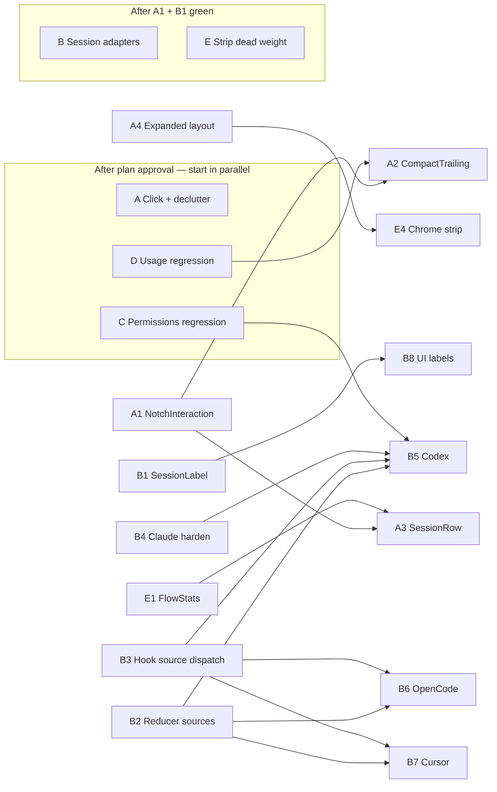

# Bezel — Three Pillars TDD Execution Plan

**Status:** ready to implement  
**Method:** London-school TDD · red → green → refactor · vertical slices  
**Domain language:** `CONTEXT.md`  
**Spine:** `NotchController`, `SessionStore`, `HookServer`, `BezelBridge`, `BezelCore` (models/reducer/routing), `ConfigInstaller`, `UsageMonitor`, `TerminalJumper`  
**Tests home:** `Tests/BezelCoreTests/` first; app wiring only after core green  
**Socket:** `~/Library/Application Support/Bezel/bezel.sock`  
**Hook script:** `~/.bezel/bezel-hook.sh` → `bezel-bridge --source <agent>`

---

## 1. Goal & non-goals

### Goal

Remake Bezel around **exactly three pillars**, with excellent minimal notch UX:

1. **Permissions** — Allow/Deny (and question/plan when blocking) in the notch, rock-solid roundtrips  
2. **Usage** — Compact % (+ reset when hot); expanded USAGE glance; **no new tab/window on click**  
3. **Sessions** — Detect Claude Code, Codex, OpenCode, Cursor properly; label as `Provider · project · phase`; show running / not running

Collapsed notch keeps: **attention color + usage % + agent count**.  
Expanded notch is only: **USAGE / NEEDS YOU / SESSIONS**. Jump is secondary never default.

### Non-goals (explicit strip / do-not-build this pass)

| Strip / freeze | Why |
|----------------|-----|
| Jump-as-default on compact trailing / usage click | Causes “new tab” UX bug (`CompactTrailing` → `store.jump`) |
| Jump-as-default on `SessionRow` single-click | Same; jump only via long-press or explicit control |
| Dense “BEZEL” branding chrome / status capsule clutter in expanded top bar | Pillars > brand theater |
| FlowStats / daily jump counters in UI | Dead weight (`FlowStats.swift` / `FlowStatsStore.recordJump`) |
| Usage charts, multi-window graphs, unused stats strips | Usage pillar = glance only |
| Gemini / Antigravity as first-class install path | Enum may remain; **no installer/adapter work** this pass |
| Smart suppress polish, sound redesign, SSH remote hooks | Later |
| Custom NSPanel / multi-monitor rewrite | Keep DynamicNotchKit |
| Menubar item proliferation / settings density | Settings stay for hooks repair only; no new chrome |
| vibe-island as primary usage source | Keep ClaudeUsage path; deprecate cache fallback if safe (see E) |
| Opening external apps/tabs from notch option clicks (esp. usage) | Hard product rule |

---

## 2. Target UX contract

### Collapsed (always-on compact)

| Slot | Content | Click |
|------|---------|--------|
| Leading | Attention/status color (dot or ring) | Expand in place (or kit default expand) — **never jump** |
| Trailing | Usage `%` (or `% · Xm` when ≥70% + reset); else live agent count; else `!` / `!N` when decisions pending | **Expand in place** — **never** `TerminalJumper` / `store.jump` |

Help text must not say “click to jump”.

### Expanded (in-place HUD)

Three sections only, in this order when content exists:

1. **USAGE** — primary % + reset line from `UsageGlance` / `ClaudeUsageSnapshot` (no charts)  
2. **NEEDS YOU** — `PermissionBand` / `QuestionBand` / slim `PlanReviewBand` when `store.needsAttention`  
3. **SESSIONS** — rows labeled `Provider · project · phase` (via new pure `SessionLabel`); running vs idle/done visually quiet

Empty state: one short quiet line (“No agents yet”) — no marketing paragraph.

### Click semantics (normative)

| Surface | Primary click | Secondary |
|---------|---------------|-----------|
| Compact trailing (usage / count / `!`) | Expand notch | — |
| Compact leading | Expand notch | — |
| Expanded USAGE region | Stay / no-op (or collapse if kit requires) | — |
| NEEDS YOU Allow / Deny / Always / answers | Resolve decision only | — |
| Session row | Select / expand detail in notch (optional highlight) — **no jump** | Long-press **or** explicit “Jump” affordance → `store.jump` |
| Usage click anywhere | **Never** open Terminal/IDE tab/window | — |

### Label format

```
Provider · project · phase
```

Examples: `Claude · Vibe · waiting`, `Codex · api · working`, `Cursor · Vibe · idle`, `OpenCode · app · done`.

- **Provider:** `bezelSourceName` / `DisplayNames` — Claude, Codex, OpenCode, Cursor (not raw enum)  
- **project:** cwd basename or cleaned session title (`DisplayNames.sessionTitle`)  
- **phase:** short human token from `SessionPhase` (`waiting` for permission/question/planReview)

---

## 3. Pillar acceptance criteria (testable)

### P1 — Permissions

- [ ] Blocking `PermissionRequest` / AskUserQuestion / ExitPlanMode still route via `PermissionRouting.routeKind` identically in bridge + server  
- [ ] Allow/Deny/Always produce valid `DecisionJSON` within decision timeout rules  
- [ ] Notch surface maps to `.approval` / `.question` / `.planReview` before `.sessionList` (`NotchSurfaceMapper`)  
- [ ] Manual: permission card appears without launching a new terminal tab  

### P2 — Usage

- [ ] `UsageGlance.compactText` still returns `%` / `% · Xm` for fixtures (existing + regression cases)  
- [ ] Compact trailing shows usage when snapshot present and no attention  
- [ ] Clicking usage **does not** call jump (characterization: intent enum / seam test; manual verify on DynamicNotchKit)  
- [ ] Expanded USAGE section renders same snapshot; no charts  

### P3 — Sessions

- [ ] Events with `--source claude|codex|opencode|cursor` set `Session.source` correctly through reducer  
- [ ] Discovery/liveness: hooks = phase truth; JSONL/SQLite/process = presence as designed per adapter  
- [ ] Labels match `Provider · project · phase` pure function tests  
- [ ] Collapsed agent count = live (non-done) sessions across providers  
- [ ] Manual: four providers appear with correct labels when fixtures/hooks fire  

### Cross-cutting UX

- [ ] No default click path from compact trailing → `TerminalJumper.jump`  
- [ ] Jump only from explicit secondary control  
- [ ] Expanded chrome limited to three sections; no FlowStats, no dense brand capsule as hero  

---

## 4. TDD workstreams

**Global rules**

1. Write failing tests in `Tests/BezelCoreTests/` before production code.  
2. Extract pure logic into BezelCore before decorating SwiftUI.  
3. One vertical slice per task; ship green before starting the next in-stream.  
4. UI-only SwiftUI: mark **characterization + manual verify**.  
5. Run `swift test` (BezelCoreTests) after every green; keep dual-routing invariant for any new source.

---

### Workstream A — Notch click semantics + declutter

**Objective:** Decouple usage/attention chrome from jump; expand-in-place; slim expanded HUD to three pillars.

#### A1 — Pure click intent (seam for “no jump on usage”)

| | |
|--|--|
| **Red tests** | `Tests/BezelCoreTests/NotchInteractionTests.swift` |
| | `compactTrailingPrimary_isExpand_neverJump` |
| | `compactTrailingWhenAttention_isExpand` |
| | `sessionRowPrimary_isSelect_notJump` |
| | `sessionRowSecondary_isJump` |
| **Implement** | New `Sources/BezelCore/NotchInteraction.swift` — `enum NotchPrimaryAction { case expand, select(SessionID), resolve }` + `enum NotchSecondaryAction { case jump(SessionID) }` + mapper from attention/usage/session context |
| **Done-when** | All four tests green; no AppKit imports |

#### A2 — Wire CompactTrailing off jump

| | |
|--|--|
| **Red tests** | Characterization in A1 already locks intent; optional thin test if extracting `CompactTrailingPolicy` |
| **Implement** | `Sources/Bezel/NotchController.swift` — `CompactTrailing`: replace `store.jump` Button action with expand (`notch` expand API / store flag already used by kit). Update `trailingHelp` copy (drop “click to jump”). |
| **Done-when** | **Manual verify:** click usage % expands HUD, Terminal/IDE does not activate. Unit: A1 still green. |

#### A3 — SessionRow secondary jump only

| | |
|--|--|
| **Red tests** | Covered by A1; if row policy extracted: `sessionRowClickPolicy_primarySelect` |
| **Implement** | `NotchController.swift` (`SessionRow`, `contextStrip`, `quietBody`): primary click → select/highlight or no-op; add long-press **or** trailing “Jump” control calling `store.jump` only then. |
| **Done-when** | **Manual verify:** single-click session does not jump; secondary does. |

#### A4 — Expanded three-section layout

| | |
|--|--|
| **Red tests** | `Tests/BezelCoreTests/NotchSurfaceTests.swift` (extend) |
| | `expandedSections_orderUsageNeedsYouSessions` — pure section planner |
| | `expandedSections_hidesEmptyUsage` / `hidesNeedsYouWhenIdle` |
| **Implement** | New `Sources/BezelCore/ExpandedNotchLayout.swift` (`ExpandedSection`: usage / needsYou / sessions). Refactor `ExpandedHUD` in `NotchController.swift` to render only those sections; remove dense top-bar brand capsule as hero (keep minimal wordmark optional, opacity-low). |
| **Done-when** | Layout tests green; **manual verify** quiet + attention modes show only pillar content. |

#### A5 — Declutter copy + help strings

| | |
|--|--|
| **Red tests** | Skip (string-only) — **characterization + manual verify** |
| **Implement** | `NotchController.swift` help/status labels; remove marketing empty-state sentence. |
| **Done-when** | Manual pass: no “click to jump” on usage; empty state one line. |

**Workstream A exit:** Compact usage click never jumps; expanded = USAGE / NEEDS YOU / SESSIONS.

---

### Workstream B — Session detection adapters + labels

**Objective:** Claude hardened; Codex + OpenCode + Cursor detected with proper labels.  
**Truth model:** hooks = live phase; JSONL/SQLite = discovery; process = liveness.

#### B1 — Session label pure function

| | |
|--|--|
| **Red tests** | `Tests/BezelCoreTests/SessionLabelTests.swift` |
| | `formatsProviderProjectPhase` |
| | `mapsWaitingPermissionToWaiting` |
| | `usesCwdBasenameAsProject` |
| | `providerNames_claudeCodexOpenCodeCursor` |
| **Implement** | `Sources/BezelCore/SessionLabel.swift` (or extend `DisplayNames.swift`) — `SessionLabel.format(session:) -> String`; phase short names; reuse `bezelSourceName` logic moved into BezelCore as `AgentSource.displayName`. |
| **Done-when** | Suite green; UI can call one function. |

#### B2 — Source propagation through reducer (all four)

| | |
|--|--|
| **Red tests** | `Tests/BezelCoreTests/SessionReducerTests.swift` (extend) |
| | `apply_preservesCodexSource` |
| | `apply_preservesOpenCodeSource` |
| | `apply_preservesCursorSource` |
| | `apply_defaultsUnknownSourceSafely` |
| **Implement** | `SessionReducer.swift`, `Models.swift` as needed; ensure envelope `source` wins over default `.claude`. |
| **Done-when** | Reducer tests green for four sources. |

#### B3 — Bridge `--source` not hardcoded to Claude only (dispatcher)

| | |
|--|--|
| **Red tests** | Prefer pure: `Tests/BezelCoreTests/HookDispatcherTests.swift` — `scriptArgs_includeSource(codex)` if extracting template; else fixture assert on generated script string in installer tests |
| | Extend `InstallerMergerHomeTests` / new `ConfigInstallerScriptTests` for multi-source script fragments |
| **Implement** | `ConfigInstaller.swift` `writeHookScript`: support `--source` parameter; per-agent wrappers or single script with env/`BEZEL_SOURCE`. `BezelBridge/main.swift` already parses `--source`. Claude path remains default. |
| **Done-when** | Generated hook for Claude still `--source claude`; Codex/OpenCode/Cursor installers emit their source; bridge peeks source into envelope. |

#### B4 — Claude adapter harden (hooks path)

| | |
|--|--|
| **Red tests** | Existing `SessionReducerTests`, `PermissionRoutingTests`, `ClaudeSettingsMergerTests` — add regression cases for SessionStart/End/Stop/PreToolUse phase truth |
| | `sessionPresence_claudeHookUpdatesPhase` if touching `SessionPresence.swift` |
| **Implement** | `ConfigInstaller` Claude merge; `HookServer` + `SessionStore` apply path; no behavior change except bugs found by red tests. |
| **Done-when** | Claude vertical slice regressions green. |

#### B5 — Codex adapter (hooks + discovery)

| | |
|--|--|
| **Red tests** | `Tests/BezelCoreTests/CodexAdapterTests.swift` |
| | `normalizesCodexEventNames` |
| | `discoversSessionsUnderCodexHome` (fixture dir, not live `~/.codex`) |
| | `labelsCodexSession` |
| **Implement** | New `Sources/BezelCore/Adapters/CodexAdapter.swift` (normalize vendor JSON → `HookPayload` / envelope fields). Installer path: `~/.codex` hooks if protocol supports; else discovery from JSONL + process liveness → synthetic session rows with `.codex`. Wire apply in `SessionStore` via shared `AgentEventIngester` seam if needed. |
| **Done-when** | Fixture-based discovery + normalize green; **manual:** one real Codex session appears labeled `Codex · …`. |

#### B6 — OpenCode adapter (config + sqlite)

| | |
|--|--|
| **Red tests** | `Tests/BezelCoreTests/OpenCodeAdapterTests.swift` |
| | `readsSessionsFromFixtureDB` |
| | `mapsOpenCodeRowToPhase` |
| | `sourceIsOpenCode` |
| **Implement** | `Sources/BezelCore/Adapters/OpenCodeAdapter.swift` — paths under `~/.config/opencode` + `opencode.db` (tests use temp DB fixtures only). Hooks if available; else poll/discover + process liveness. |
| **Done-when** | Fixture DB tests green; **manual:** OpenCode session labeled correctly. |

#### B7 — Cursor adapter (hooks.json activate-aware)

| | |
|--|--|
| **Red tests** | `Tests/BezelCoreTests/CursorAdapterTests.swift` |
| | `parsesCursorHooksJson` |
| | `activateOnlyEvents_markLiveWithoutFakePhase` |
| | `labelsCursorSession` |
| **Implement** | `Sources/BezelCore/Adapters/CursorAdapter.swift` — `~/.cursor/hooks.json` install/merge (pure merger in BezelCore, filesystem in `ConfigInstaller`). Respect activate-only limitations: presence/liveness without inventing permission phases Cursor does not emit. |
| **Done-when** | Tests green; Cursor shows in SESSIONS with honest phase (often `working`/`idle` from process+hooks). |

#### B8 — UI labels on SessionRow

| | |
|--|--|
| **Red tests** | B1 covers format |
| **Implement** | `NotchController.swift` `SessionRow` / attribution use `SessionLabel.format`; remove ad-hoc string concat that jumps provider. |
| **Done-when** | **Manual verify** four-provider labels; unit B1 green. |

**Workstream B exit:** Four providers detectable with correct labels; Claude permissions still via hooks.

---

### Workstream C — Permissions path regression (rock-solid)

**Objective:** No regressions while A/B/E churn UI and multi-source.

#### C1 — Routing dual-invariant lock

| | |
|--|--|
| **Red tests** | `Tests/BezelCoreTests/PermissionRoutingTests.swift` — table cases for PermissionRequest, AskUserQuestion, ExitPlanMode, Notification non-block; add `source` matrix (`claude`/`codex`/…) proving Claude rules unchanged |
| **Implement** | `PermissionRouting.swift` only if a test fails; do not widen Gemini PreToolUse this pass |
| **Done-when** | Full routing suite green |

#### C2 — Decision JSON + timeout + queue

| | |
|--|--|
| **Red tests** | Existing `DecisionJSONTests`, `DecisionTimeoutTests`, `DecisionQueueTests`, `DecisionIngressTests` — add one cross-source permission fixture each if missing |
| **Implement** | Touch only on red |
| **Done-when** | Suites green |

#### C3 — Reducer waiting phases

| | |
|--|--|
| **Red tests** | `SessionReducerTests` — permission → `waitingPermission`; question → `waitingQuestion`; plan → `planReview`; allow clears |
| **Implement** | `SessionReducer.swift` |
| **Done-when** | Green |

#### C4 — Permission UI bands (characterization)

| | |
|--|--|
| **Red tests** | Keep `NotchSurfaceTests` priority; no SwiftUI unit tests |
| **Implement** | Preserve `PermissionBand` / `QuestionBand`; slim `PlanReviewBand` only if it fights three-section layout (A4) |
| **Done-when** | **Manual:** Allow/Deny roundtrip; Claude does not hang; no jump on Allow |

**Workstream C exit:** Permission regressions locked; manual Allow/Deny still <~100ms feel.

---

### Workstream D — Usage path regression (rock-solid, no charts)

**Objective:** Keep `UsageMonitor` + `ClaudeUsage` + `UsageGlance`; never couple to jump.

#### D1 — UsageGlance regressions

| | |
|--|--|
| **Red tests** | `Tests/BezelCoreTests/UsageGlanceTests.swift` — `%`, countdown ≥70%, nil primary |
| **Implement** | `UsageGlance.swift` / `ClaudeUsage.swift` only on red |
| **Done-when** | Green |

#### D2 — ClaudeUsage parser fixtures

| | |
|--|--|
| **Red tests** | `Tests/BezelCoreTests/ClaudeUsageTests.swift` — extend with statusline / OAuth fixture shapes used in prod |
| **Implement** | `ClaudeUsage.swift`, `ClaudeUsageFetcher.swift` if needed |
| **Done-when** | Green |

#### D3 — Usage click isolation (policy)

| | |
|--|--|
| **Red tests** | Reuse A1 `NotchInteractionTests` — `usageSurface_primaryActionExpand` |
| **Implement** | Ensure `UsageMonitor` / store usage updates do not trigger jump side effects; `SessionStore` must not call `TerminalJumper` on usage epoch |
| **Done-when** | Grep-level guarantee: no jump from usage code paths; A1+D1 green |

#### D4 — Expanded USAGE section only (no charts)

| | |
|--|--|
| **Red tests** | A4 section planner |
| **Implement** | `ExpandedHUD` usage footer → USAGE section; delete any chart experiments if present |
| **Done-when** | Manual: USAGE readable; click does nothing external |

**Workstream D exit:** Usage glance stable; click never opens a tab.

---

### Workstream E — Strip dead weight

**Objective:** Remove clutter that fights the three pillars.

#### E1 — Stop FlowStats as product surface

| | |
|--|--|
| **Red tests** | If any FlowStats tests exist, convert to “store is inert / unused”; else add `FlowStatsStore_recordJump_doesNotAffectGlance` only if keeping API |
| **Implement** | Remove `FlowStatsStore.recordJump()` from `SessionStore.jump`; leave file deprecated or delete if unused (`FlowStats.swift`). No UI binding. |
| **Done-when** | Jump path does not persist stats; no stats in notch |

#### E2 — Soften vibe-island usage fallback

| | |
|--|--|
| **Red tests** | `ClaudeUsageTests` / new — Bezel primary sources win over `.vibe-island/cache/rl.json` |
| **Implement** | `UsageMonitor.swift`: gate vibe-island cache behind explicit fallback only when Claude sources missing; prefer remove if redundant |
| **Done-when** | Tests assert primary path; fallback documented or gone |

#### E3 — Competing island hooks: keep repair, drop prominence

| | |
|--|--|
| **Red tests** | Existing `CompetingMarkersTests` / merger tests stay green |
| **Implement** | `SettingsView.swift`: keep “Replace vibe-island / CodeIsland hooks” as repair action, not primary chrome; no new menubar items |
| **Done-when** | Settings still can repair; notch unchanged |

#### E4 — Chrome / branding strip

| | |
|--|--|
| **Red tests** | A4 layout |
| **Implement** | `NotchController` / `ExpandedHUD`: remove dense status capsule, unused stats, jump-as-primary affordances; Gemini need not appear in onboarding |
| **Done-when** | Manual visual: calm three-section HUD |

#### E5 — Jump remains capability, not pillar

| | |
|--|--|
| **Red tests** | `TerminalJumpPlanTests` stay green (no behavior break) |
| **Implement** | `TerminalJumper.swift` untouched except call sites; ensure only secondary UX calls `store.jump` |
| **Done-when** | Jump works from secondary control; never from usage |

**Workstream E exit:** Dead weight gone; jump demoted; vibe-island not a product dependency.

---

## 5. Parallelization map



| Stream | Can start immediately? | Depends on | Blocks |
|--------|------------------------|------------|--------|
| **A** Click/declutter | Yes (A1 first) | — | A2/A3 need A1; A4 feeds E4 |
| **C** Permissions | Yes | — | Soft gate before claiming B multi-source “done” |
| **D** Usage | Yes | — | A2 should land after D1 green to avoid flaky manual QA |
| **B** Adapters | After B1+B2 (+B3 for install) | A1 optional | B5/B6/B7 parallelizable **with each other** once B2+B3 green |
| **E** Strip | E1/E2/E3 parallel with A | E4 after A4 | — |

**Recommended squad split (post-approval):**

1. **Agent UX:** A1→A2→A3→A4 (+ E4)  
2. **Agent Core-guard:** C1–C4 ∥ D1–D4 ∥ E1–E3  
3. **Agent Adapters:** B1→B2→B3→B4 then B5 ∥ B6 ∥ B7 → B8  

Do not parallelize two writers on `NotchController.swift` — serialize A2/A3/A4/B8/E4 on that file (or extract views first).

---

## 6. Risk notes

| Risk | Mitigation |
|------|------------|
| **Hook conflicts** (vibe-island / CodeIsland / multi-tool hooks) | Keep `ClaudeSettingsMerger` competing-marker guards; repair remains explicit settings action; never auto-wipe foreign hooks on launch |
| **Cursor activate-only** | Do not invent `waitingPermission` from Cursor; show liveness + best-effort phase; document honesty in labels (`idle`/`working`) |
| **Codex / OpenCode event shapes differ from Claude** | Normalize in adapters to `HookPayload` / `HookEventName`; fixture-first tests; unknown events → `.event` never block |
| **OpenCode sqlite path variance** | Adapter accepts configurable DB URL; tests use temp fixtures; probe `~/.config/opencode` at runtime only |
| **Dual-routing drift** when adding sources | Every source PR adds `PermissionRouting` case + bridge blocking fixture together |
| **DynamicNotchKit expand API limits** | If compact click cannot expand programmatically, use store-driven expand already used elsewhere; **manual verify** early in A2 — escalate to kit/ADR only if blocked |
| **Hardcoded `--source claude` in hook script** | B3 must ship before non-Claude hooks work in prod; discovery-only adapters can ship earlier for SESSIONS list |
| **Jump muscle memory** | Secondary Jump control must be obvious enough for power users; do not remove `TerminalJumper` |

---

## 7. Out of scope for this pass

- Gemini / Antigravity installers and PreToolUse-as-permission  
- Usage charts, billing deep-dives, multi-account usage  
- Smart suppress / sound redesign / onboarding rewrite beyond dropping clutter  
- Custom NSPanel, multi-monitor focus rewrite  
- SSH remote hooks  
- Menubar-first redesign (notch remains the product)  
- Telemetry, Sentry, cloud sync  
- Replacing DynamicNotchKit  
- Making Jump a pillar or improving Warp/Cursor jump fidelity beyond keeping secondary jump alive  
- Electron / web rewrite  

---

## Implementer quick start (no more research)

1. Open this doc + `CONTEXT.md`.  
2. Run existing suite: `swift test --filter BezelCoreTests`.  
3. Start **A1** (`NotchInteraction`) and **C1**/**D1** in parallel.  
4. Land **A2** immediately after A1 (fixes the usage→jump bug).  
5. Proceed B1→B2→B3, then adapters B5∥B6∥B7.  
6. Gate “done” on §3 checkboxes + manual: usage click expands only; Allow/Deny works; four labels appear.

**Definition of Done (pass):** Three pillars only in the notch; usage click never opens a tab; permissions solid; Claude/Codex/OpenCode/Cursor sessions labeled `Provider · project · phase`; dead chrome/FlowStats/jump-default removed.
